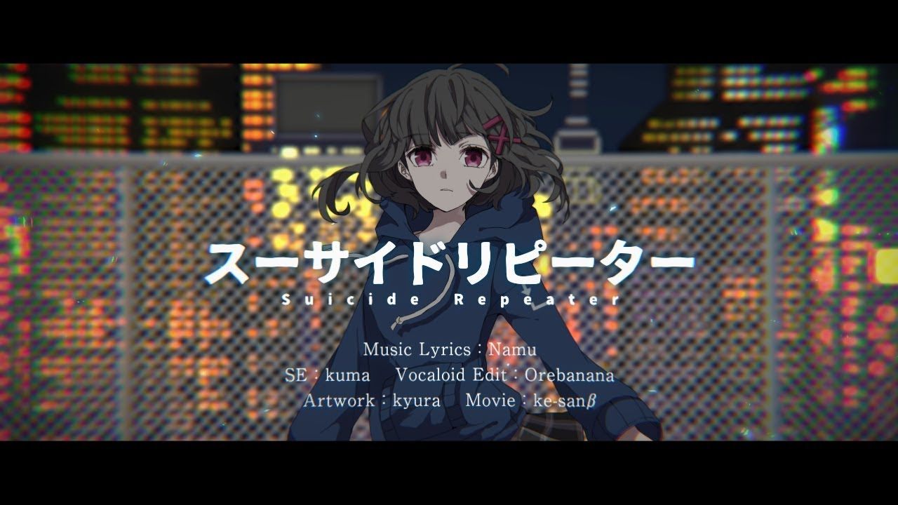

# **APITest** - Enver Aman (Updated 2020/10/14)  

A short playlist for testing out the API.

---

Playlist ID: PLorw3mfu-J0gEgljMVhsWcIzZYaYL29_u  
Channel ID: UCQ9hj9sJkQy_egSinyMMDcA  

Total Videos: 3  
Available: 3  
Unavailable: 0  

---

 

## **1.** https://www.youtube.com/watch?v=u5FwAsufdQE

**Title:** 【東方ボーカル】 「レディメイド・シティライフ」 【ShibayanRecords】  
**Author:** Alice Margatroid  
**Video ID:** u5FwAsufdQE  
**Date Published:** 2013/12/29, 10:30:02 UTC  
**Duration:** 00:10:21  

**Thumbnails:**  
default: https://i.ytimg.com/vi/u5FwAsufdQE/default.jpg  
medium: https://i.ytimg.com/vi/u5FwAsufdQE/mqdefault.jpg  
high: https://i.ytimg.com/vi/u5FwAsufdQE/hqdefault.jpg  
standard: https://i.ytimg.com/vi/u5FwAsufdQE/sddefault.jpg  
maxres: https://i.ytimg.com/vi/u5FwAsufdQE/maxresdefault.jpg  

**Description:**  
>☯ Title： レディメイド・シティライフ \(Lady Maid City Life\)  
>☯ Vocal： milka  
>☯ Arrangement： Shibayan  
>☯ Lyric： milka  
>☯ Circle： ShibayanRecords  
>☯ Album： RETRO FUTURE GIRLS  
>☯ Release Date： Dec 30, 2013 \(Comiket 85\)  
>  
>http://shibayan\.la\.coocan\.jp/  
>ダウンロードはこっち \(Digital Download Here\)  
>https://shibayan\.booth\.pm/items/259246  
>  
>☯ Original： 少女綺想曲 ～ Dream Battle ／ Maiden's Capriccio ~ Dream Battle  
>「東方永夜抄 ～ Imperishable Night, Hakurei Reimu's theme」  
>  
>☯ Illustration： Riichu  
>http://www\.pixiv\.net/member\_illust\.php?mode=medium&illust\_id=9229374  
>  
>Enjoy\!
---

 

## **2.** https://www.youtube.com/watch?v=6u2x56RMTFY

**Title:** スーサイドリピーター / 名無（Namu）feat\.初音ミク  
**Author:** ke\-san β  
**Video ID:** 6u2x56RMTFY  
**Date Published:** 2018/03/01, 12:10:46 UTC  
**Duration:** 00:03:16  

**Thumbnails:**  
default: https://i.ytimg.com/vi/6u2x56RMTFY/default.jpg  
medium: https://i.ytimg.com/vi/6u2x56RMTFY/mqdefault.jpg  
high: https://i.ytimg.com/vi/6u2x56RMTFY/hqdefault.jpg  
standard: https://i.ytimg.com/vi/6u2x56RMTFY/sddefault.jpg  
maxres: https://i.ytimg.com/vi/6u2x56RMTFY/maxresdefault.jpg  

**Description:**  
>名無（Namu）です。初投稿です。  
>よろしくおねがいします、  
>  
>  
>  
>  
>『僕は醒めない夢の中』  
>  
>  
>  
>  
>Music/Lyrics ： 名無（Namu）@namu\_p0 （mylist/61162360）  
>SE ： くま @KUMA\_composer  
>Vocaloid Edit ： おればなな （mylist/5843220）  
>Artwork ： きゅら @kyura9ra\_  
>Movie ： ke\-sanβ（mylist/14639164）  
>  
>  
>off vocal → http://piapro\.jp/namu\_0p  
>  
>次作 → グッバイ人生　https://youtu\.be/3ZjZH1wRlIE  
>  
>ニコニコ版 → http://www\.nicovideo\.jp/watch/sm32813955
---

 

## **3.** https://www.youtube.com/watch?v=xgO-uGH7tho

**Title:** Mitchie M \- 初音ミク『暗殺プリンセス』\(マンガ風MV\)  
**Author:** Mitchie M  
**Video ID:** xgO\-uGH7tho  
**Date Published:** 2019/10/30, 08:30:27 UTC  
**Duration:** 00:03:23  

**Thumbnails:**  
default: https://i.ytimg.com/vi/xgO-uGH7tho/default.jpg  
medium: https://i.ytimg.com/vi/xgO-uGH7tho/mqdefault.jpg  
high: https://i.ytimg.com/vi/xgO-uGH7tho/hqdefault.jpg  
standard: https://i.ytimg.com/vi/xgO-uGH7tho/sddefault.jpg  

**Description:**  
>60年代スパイ映画のようなサウンドと、効果音を多く入れた音楽をバックに、初音ミクがスナイパーを演じるマンガ風MVです。2019年11月6日\(水\)発売の、Mitchie M feat\. 初音ミク 6年ぶりニューアルバム『バーチャル・ポップスター』収録曲です。  
>  
>▶︎ アルバム特設サイト：https://sp\.wmg\.jp/mitchie\-m/  
>  
>  
>▶︎ インスト音源配布  
>https://soundcloud\.com/mitchiem/assassin\-princess\-inst  
>  
>▶︎ カラオケ音源配布  
>https://soundcloud\.com/mitchiem/assassin\-princess\-karaoke  
>  
>▶︎ 歌詞テキスト  
>http://mitchie\-m\.com/blog/hatsune\-miku/lyrics/assassin\-princess\-jp/  
>▶︎ niconico  
>https://www\.nicovideo\.jp/watch/sm35878313  
>  
>音楽：Mitchie M  
>⇒ http://www\.mitchie\-m\.com  
>イラスト：白狼  
>⇒ http://www\.eonet\.ne\.jp/~fwkh4588/pairan\.htm  
>動画：yama\_ko  
>⇒ http://www\.yama\-ko\.net  
>  
>  
>◆ 『バーチャル・ポップスター』先行配信も主要配信サイトで開始してます！  
>\-\-\-\-\-\-\-\-\-\-\-\-\-\-\-\-\-\-\-\-\-\-\-\-\-\-\-\-\-\-\-\-\-\-\-\-  
>レコチョクとmoraでは、10/11から4週連続で先行配信されるシングル、または11/6配信のアルバム「バーチャル・ポップスター」、または収録曲シングルいずれかをご購入いただいた方の中から応募抽選で10名様に、【Mitchie Mサイン入り「バーチャル・ポップスター」B2ポスター】  
>をプレゼント！  
>   
>【特典対象】  
>10/11配信「ガールズフレンドシップ feat\. 初音ミク & 巡音ルカ」シングル  
>10/18配信「BELIEVE IN YOURSELF feat\. 初音ミク 2019」シングル  
>10/25配信「自己愛性カワイズム feat\. 初音ミク」シングル  
>11/ 1配信「REBEL DIVA feat\. 初音ミク 2019」シングル  
>11/6配信「バーチャル・ポップスター」および収録曲シングル（ハイレゾあり）  
>   
>【応募期間】 10/11 00:00 ～ 11/12 23:59  
>\-\-\-\-\-\-\-\-\-\-\-\-\-\-\-\-\-\-\-\-\-\-\-\-\-\-\-\-\-\-\-\-\-\-\-\-\-  
>  
>  
>◆ また、ソニーストア大阪で、シアタールームで『バーチャル・ポップスター』の視聴会を実施！  
>\-\-\-\-\-\-\-\-\-\-\-\-\-\-\-\-\-\-\-\-\-\-\-\-\-\-\-\-\-\-\-\-\-\-\-\-\-  
>ソニーストア大阪でシアタールームでの視聴会を開催します！ハイレゾ音源による楽曲をソニーストアの迫力の音響システムで体感できる貴重な機会です。ぜひお楽しみください！  
>   
>ハイレゾ楽曲試聴：2019年10月17日\(木\)～11月30日\(土\)  
>レコード盤試聴：2019年11月上旬～11月30日\(土\)予定  
>  
>・ソニーストア 大阪 11/17 ※事前予約制  
>https://ers\.sony\.jp/SEvent/pageEventDetailEVT?e=a2O5F000004KaUnUAK&p=%E5%A4%A7%E9%98%AA  
>  
>詳しくはこちらから！  
>https://wmg\.jp/mitchie\-m/news/84302  
>\-\-\-\-\-\-\-\-\-\-\-\-\-\-\-\-\-\-\-\-\-\-\-\-\-\-\-\-\-\-\-\-\-\-\-\-\-  
>  
>\- \- \- \- \- \- \- \- \- \- \- \- \- \- \- \- \- \- \- \- \- \- \- \- \- \- \- \- \- \- \- \- \- \- \- \- \- \- \- \- \- \- \- \- \- \- \- \- \-  
>  
>Special Thanks  
>  
>◆ Chinese Lyrics translation by AZUSA  
>⇒ https://twitter\.com/ru\_azusa  
>  
>\- \- \- \- \- \- \- \- \- \- \- \- \- \- \- \- \- \- \- \- \- \- \- \- \- \- \- \- \- \- \- \- \- \- \- \- \- \- \- \- \- \- \- \- \- \- \- \- \-  
>  
>Mitchie M  
>【Official Site】http://www\.mitchie\-m\.com  
>【Blog】http://mitchie\-m\.com/blog/  
>【SoundCloud】https://soundcloud\.com/mitchiem  
>【Twitter】https://twitter\.com/\_MitchieM  
>【facebook】https://www\.facebook\.com/Mitchie\.M\.Official/  
>  
>\#HatsuneMiku \#初音ミク \#MitchieM