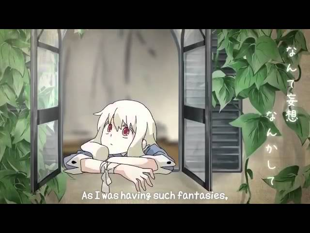
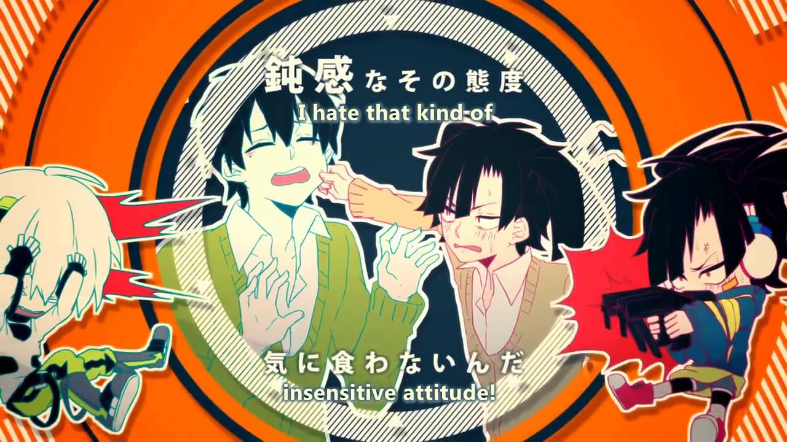

# **Kagerou Project (All Songs - In Order)** - Kiana Tuttle (Updated 2020/10/14)

Every KagePro song ever. Enjoy.

Also, I threw in the IA ROCKS version of the anime opening because it's great and I can, so there. Oh look, RED is in there too.

Update: GUYS A NEW SONGGGGGGG okay SO it's about Ayano's final thoughts basically? The mv is so good I'm cryingg. Also the new album comes out in November so pre-order that boi, link in the newest song  

---

Playlist ID: PLc3ovJ5PZjKRleiWwSlIBMtql8nYISZaJ  
Channel ID: UCHXNxE80wdRfHuZUSuNs8wg  

Total Videos: 26  
Available: 24  
Unavailable: 2  

---

 

## **1.** https://www.youtube.com/watch?v=hN_UJHwDFk0

**Title:** \[English Subs\] Hatsune Miku \- Jinzou Enemy \[Kagerou Project FANMADE PV\]  
**Author:** Kogami  
**Video ID:** hN\_UJHwDFk0  
**Date Published:** 2013/04/19, 12:47:09 UTC  
**Duration:** 00:04:18  

**Thumbnails:**  
default: https://i.ytimg.com/vi/hN_UJHwDFk0/default.jpg  
medium: https://i.ytimg.com/vi/hN_UJHwDFk0/mqdefault.jpg  
high: https://i.ytimg.com/vi/hN_UJHwDFk0/hqdefault.jpg  
standard: https://i.ytimg.com/vi/hN_UJHwDFk0/sddefault.jpg  
maxres: https://i.ytimg.com/vi/hN_UJHwDFk0/maxresdefault.jpg  

**Description:**  
>Jinzou Enemy \(人造エネミー\) also known as "Artificial Enemy" or "Manmade Enemy"\. \(but I prefer keeping it as "Jinzou Enemy"\) This is the first song in the Kagerou Project series\.  
>\-\-  
>=THIS PV IS FANMADE=  
>  
>more info:  
>http://p\.tl/dtkx \(Jinzou Enemy wiki page\)  
>http://p\.tl/W\_Uz \(Kagerou Project wiki page on Vocaloid wiki\)  
>My Kagepro playlist\! http://www\.youtube\.com/playlist?list=PLnG3LHAsVLPVezo4G3jhrmNSISu45cGDl  
>  
>Getting into Kagepro? Here's a great fanmade guide\! http://destination\-of\-fate\.tumblr\.com/post/69928272958/a\-giant\-guide\-to\-kagerou\-project\-and\-mekakucity  
>\-\-  
>I decided to sub this song using this fanmade PV since this PV have reference to other KagePro songs like "HeadPhone Actor","Toumei Answer","Lost Time Memory",etc\. This is my fav Fanmade PV for this song so far\.  
>  
>I do not own anything,not even the translations\. I only subbed this video and that's all\. This is my first time fansubbing,I don't know if I'll be subbing more in the future,but I hope the subs are readable\. I'm sorry for the quality of this video\-\-  
>  
>Song belongs to Jin/Shizen\-no\-teki\-P \(http://www\.nicovideo\.jp/watch/sm13628080\)  
>Fan\-PV belongs to Taeko \(http://www\.nicovideo\.jp/watch/sm20587507\)  
>Translations belongs to vgperson\. \(http://vgperson\.com\)  
>MP3: http://nicomimi\.net/play/sm13628080  
>Instrumental/Off Vocal/Karaoke: http://nicomimi\.net/play/sm13690707
---

 

## **2.** https://www.youtube.com/watch?v=wM-U279Z03c

**Title:** \[English Subs\] Hatsune Miku \- Mekakushi Code \[Kagerou Project FANMADE PV\]  
**Author:** Kogami  
**Video ID:** wM\-U279Z03c  
**Date Published:** 2013/07/02, 08:14:14 UTC  
**Duration:** 00:03:48  

**Thumbnails:**  
default: https://i.ytimg.com/vi/wM-U279Z03c/default.jpg  
medium: https://i.ytimg.com/vi/wM-U279Z03c/mqdefault.jpg  
high: https://i.ytimg.com/vi/wM-U279Z03c/hqdefault.jpg  
standard: https://i.ytimg.com/vi/wM-U279Z03c/sddefault.jpg  

**Description:**  
>"Mekakushi Code" \(メカクシコード\) or "Blindfold Code",the 2nd song in the Kagerou Project song series\.  
>\*The title of this song sometimes translanted as "Mekakushi Chord"\.  
>More info about this song and Kagerou Project:  
>http://p\.tl/kuKM \(Mekakushi Code wiki\)  
>http://p\.tl/W\_Uz \(Kagerou Project on Vocaloid wiki\)  
>  
>My kagepro playlist\! http://www\.youtube\.com/playlist?list=PLnG3LHAsVLPVezo4G3jhrmNSISu45cGDl  
>  
>=THIS PV IS FANMADE=  
>  
>Uwaah,my 2nd time fansubbing/typesetting,hopefully,the subs are readable ;; I just love this fan\-PV and I'm spreading the love by subbing it,I guess?  
>I'm sorry if the translations aren't that great\. I took it from KagePro wikia\. I normally use vgperson's translation,but she didn't translate this song orz\. and sorry about the screen size of this vid,the original PV itself is not HD I think?  
>  
>Fanmade PV belongs to Mihaya  
>\(http://www\.nicovideo\.jp/watch/sm20759703\)  
>Song belongs to Jin \(Shizen\-no\-Teki\-P\)  
>\(http://www\.nicovideo\.jp/watch/sm14595248\)  
>Translations belongs to soundslikematsuda  
>I own nothing in this vid,I only subbed it\.  
>  
>MP3: http://nicomimi\.net/play/sm14595248  
>Off Vocal/Instrumental/Karaoke: http://nicomimi\.net/play/sm14664261
---

 

## **3.** https://www.youtube.com/watch?v=Hsc4LW-la-M

**Title:** Headphone Actor \[IA\] English Sub  
**Author:** HopeandJoy9  
**Video ID:** Hsc4LW\-la\-M  
**Date Published:** 2011/12/17, 21:04:10 UTC  
**Duration:** 00:03:37  

**Thumbnails:**  
default: https://i.ytimg.com/vi/Hsc4LW-la-M/default.jpg  
medium: https://i.ytimg.com/vi/Hsc4LW-la-M/mqdefault.jpg  
high: https://i.ytimg.com/vi/Hsc4LW-la-M/hqdefault.jpg  

**Description:**  
>THE FOLLOWING IS A REFERENCE TO THE MOVIE "THE TRUMAN SHOW":  
>  
>It's a shame The IA Show got cancelled\.  
>  
>Song: Headphone Actor \(ヘッドフォンアクター\)  
>Music and Lyrics: Jin  
>Singer: IA  
>PV: Shidu  
>Translation: vgperson
---

 

## **4.** https://www.youtube.com/watch?v=vXB2tFFYr58

**Title:** IA \- Imagination Forest \(english subs\)  
**Author:** Eva G  
**Video ID:** vXB2tFFYr58  
**Date Published:** 2012/04/27, 00:15:43 UTC  
**Duration:** 00:04:13  

**Thumbnails:**  
default: https://i.ytimg.com/vi/vXB2tFFYr58/default.jpg  
medium: https://i.ytimg.com/vi/vXB2tFFYr58/mqdefault.jpg  
high: https://i.ytimg.com/vi/vXB2tFFYr58/hqdefault.jpg  
standard: https://i.ytimg.com/vi/vXB2tFFYr58/sddefault.jpg  

**Description:**  
>This Doesn't Belong to me\!  
>From: http://www\.youtube\.com/watch?v=8u67yZb7bSM  
>Sorry if u think i'm copying, I just want to get this to more people ^\.^;  
>  
>I love this song, especially after reading the lyrics ^\.^
---

 

## **5.** https://www.youtube.com/watch?v=u6K9gv487BQ

**Title:** Hatsune Miku & IA \- Konoha's State of the World \(コノハの世界事情\)  
**Author:** zcatcracker  
**Video ID:** u6K9gv487BQ  
**Date Published:** 2012/03/31, 07:57:04 UTC  
**Duration:** 00:03:06  

**Thumbnails:**  
default: https://i.ytimg.com/vi/u6K9gv487BQ/default.jpg  
medium: https://i.ytimg.com/vi/u6K9gv487BQ/mqdefault.jpg  
high: https://i.ytimg.com/vi/u6K9gv487BQ/hqdefault.jpg  

**Description:**  
>A song about a human \(?\) waking up\.  
>  
>The Kagerou Project song series has been released on an album May 30th, 2012, titled "Mekakushitei Deizu" \(Blindfold City Days/Daze\)\.  
>  
>Reprinted from: http://www\.nicovideo\.jp/watch/sm17397763  
>Composer: Jin/Shizen\-no\-TekiP  じん （自然の敵P）  
>Video: Shidzu \(mylist/24067227\), Wan\-nyan\-pu\- \(WoofMeowOink\)  
>Lead Guitar: Nakanishi \(中西; mylist/14052593\)  
>Drum: Yu\-mao \(ゆーまお; mylist/16352476\)  
>Bass: Mashiro Shirakami  
>  
>Liner Notes:  
>\- Konoha is the name of this new character\. It also means "leaf" and the allusion is made at 2:05\.  
>\- 2:10 \- The splattered texts are news clippings of the various deaths from Heat\-Haze Daze\.  
>  
>There seems to be a running theme about eyes, if Jin's MyList description of each song is anything to go by:  
>  
>Man\-Made Enemy is a song about turning away your eyes\.  
>Blindfold Code, hiding your eyes\.  
>Heat\-Haze Daze/Days is a story that will overwhelm your eyes, if not general senses\.  
>Headphone Actor, doubting your eyes\.  
>Imagination Forest, seeing eye\-to\-eye\.  
>And now we're at Konoha, a person who is waking up \(opening his eyes\)\.
---

 

## **6.** https://www.youtube.com/watch?v=1xeTDHAPqvQ

**Title:** 【Noerton Subs】Kisaragi Attention\-IA \(Romaji and English Subs\)  
**Author:** VocaFan4ever  
**Video ID:** 1xeTDHAPqvQ  
**Date Published:** 2012/05/31, 03:55:03 UTC  
**Duration:** 00:04:07  

**Thumbnails:**  
default: https://i.ytimg.com/vi/1xeTDHAPqvQ/default.jpg  
medium: https://i.ytimg.com/vi/1xeTDHAPqvQ/mqdefault.jpg  
high: https://i.ytimg.com/vi/1xeTDHAPqvQ/hqdefault.jpg  
standard: https://i.ytimg.com/vi/1xeTDHAPqvQ/sddefault.jpg  

**Description:**  
>I DID NOT TRANSLATE THIS  
>  
>\(Romaji and English Lyrics\)  
>  
>wow ikisaki wa doushiyou chotto shifuku ja mazui kana  
>aa, nani mo kamo houri dashi chatta gogo  
>wow senobi shita hiiru ja chotto fumi dashi nikui kara sa  
>sukoshi rafu ni fudo tsukete bare nai youni ikou  
>shoutengai roji ura e nukete  
>aa, nanda ka doki doki shichai sou da  
>fuini kaze ga fui tara fuudo ga nugete sugu sama kanshuu mesen da  
>「\.\.\.yappa itsumo doori no shuumatsu ni nacchai sou desu」  
>sanzan dana yametai na man'in'onrei\! nante iu kedo  
>sono jitsu buru nano de komacchau yo medacchau na  
>sanzan dana nigetai na kitai shichau yo\.  
>「mou watashi wo minaide\!\!」\.\.\. nante kotoba mo poketto nishi maou\.  
>wow mukashi kara nande ka chotto hitome wo hikunda yo na  
>sore mo maa, mou nare hajimete shimai sou  
>wow kiita koto arunda chotto omoi dasenai kedo  
>「aa mou\! iyana taishitsu dana」 sonna koto ie moshi nai keredo  
>oo doori ga panikku ni kawaru  
>mou aidoru nante yamecha itai yo  
>「konna koto ni naru to wa\.\.\.」ano hi no baka na watashi wa tanjun shikou de  
>chotto suteeji raito ni yume wo egai chattandesu\.\.\.  
>sanzan dayo ie nai yo kansei ga afurechau kedo  
>「kore sonna ii desu ka\.\.\.?」 tsumannai yo wakaranai yo  
>sanzan dana kietai na koe ni narazu ni  
>「iya da\. namida ga dechau yo」 sonna kotoba de poketto wo umeta  
>\.\.konnan ja mou ikenai ne kansei ga kikoeteru desho?  
>yume miteta fuukei ni kizuitara mou deatte ite  
>「sanzan」nara kaetai na hitori janai yo  
>sa kakko tsukenai you na kotoba de  
>aa, nandaka ike sou da\! shinzou ga hajikechau hodo  
>afuredashi sou nano de ubacchau yo\!? ubacchau yo\!?  
>tsutaetai koto tsume konda sonna「yume」kara  
>mou me wo hanasanai de saa saa, ashita mo sukippu de susumou\!\!  
>  
>Wow \- where am I going tp go? I dunno if regular clothes will work out\.\.\.   
>Ahh, everything's getting given up this afternoon\.\.\.   
>  
>Wow \- if I wear those tall heels, it'll be a little hard to walk   
>So I'll just throw on this hood, and try not to be found out\.\.\.   
>  
>In the shopping district, through back alleys   
>Ah, my heart is kind of starting to pound\.\.\.   
>  
>Suddenly, the wind blows, lifts my hood, and I'm the center of attention;   
>"\.\.\.I guess I'm not having a regular weekend after all\.\.\."   
>  
>It's so harsh, I want to give up \- sure, you give me a full house,   
>But it really makes me blue; so I get anxious \- I really stand out\.\.\.   
>It's so harsh, I want to run away \- that's what I start to hope for\.   
>"Don't look at me anymore\!\!" \.\.\.But I stuff the words away in my pocket\.   
>  
>Wow \- for such a long time, I've sort of caught people's attention,   
>And I started getting used to even that\.\.\.   
>  
>Wow \- I've heard it before, but I can't exactly seem to remember\.\.\.   
>"Argh, geez\! My constitution sucks\!" But of course, I didn't ever say it\.\.\.   
>  
>As the streets switch into panic,   
>It just makes me want to give up on being an idol\.\.\.   
>  
>"To think it would be like this\.\.\." But I thought so foolishly and simply then,   
>And I planned out my dreams in the glare of the stage lights\.\.\.   
>  
>It's so harsh, but I can't say it \- I'm drowned in cheering, but\.\.\.   
>"Am I really that good\.\.\.?" I'm just a bore \- I don't get it\!   
>It's so harsh, I want to vanish \- but I can't speak up   
>"No\. You're making me cry\.\.\." But I bury away the words in my pocket\.\.\.   
>  
>\.\.\.You can't do this anymore; you hear the cheering, don't you?   
>The things you dreamed of are already right in front of you\.\.\.   
>If it's "harsh," then change it \- you know you're not alone\!   
>Now say it \- and no need to sound too stylish\.\.\.   
>  
>Ahh, I think I can do it\! I feel like my heart's going to burst,   
>It's overflowing so much; so can I steal yours away?\!   
>This "dream" is packed to the brim with all that I want to say\.\.\.   
>So don't take your eyes off it\! And so tomorrow, let's keep skipping ahead\!\!
---

 

## **7.** https://www.youtube.com/watch?v=ZwuaYUer00U

**Title:** \[IA\] Children Record チルドレンレコード PV \(English subs\)  
**Author:** thisendlessforest  
**Video ID:** ZwuaYUer00U  
**Date Published:** 2012/07/21, 22:37:31 UTC  
**Duration:** 00:03:05  

**Thumbnails:**  
default: https://i.ytimg.com/vi/ZwuaYUer00U/default.jpg  
medium: https://i.ytimg.com/vi/ZwuaYUer00U/mqdefault.jpg  
high: https://i.ytimg.com/vi/ZwuaYUer00U/hqdefault.jpg  
standard: https://i.ytimg.com/vi/ZwuaYUer00U/sddefault.jpg  
maxres: https://i.ytimg.com/vi/ZwuaYUer00U/maxresdefault.jpg  

**Description:**  
>Yes\!\! A continuation of Jin's/Shizen no Teki\-P amazing series the Kagerou Project\. Also the manga Kagerou Days can be read on Mangafox\!  
>  
>Other songs of the series:  
>  
>Moon Viewing Recital  
>Ayano's Happiness Theory  
>Ene's Cybernetic Adventures  
>Dead and Seek  
>Shinigami Record  
>Lost Time Memory  
>Night Tales Decieve  
>Artificial Enemy  
>Konoha's State of the World  
>Kisaragi Attention  
>Blindfold cord  
>Transparent Answer  
>Headphone Actor  
>Imagination Forest  
>Heat\-Haze Days  
>  
>English and Romaji lyrics: vgperson  
>  
>Original: http://www\.nicovideo\.jp/watch/sm18406343  
>【IA】チルドレンレコード【オリジナルPV】  
>  
>ROMAJI:  
>  
>  
>Shiroi iyahon o mimi ni ate sukoshi niya tto shite aizu suru   
>Shimikonda kono ondo ga doa o nokku shita shunkan ni afuresou ni naru yo   
>"Mada mienai?" Me o korashite nozomu soudatsusen   
>Ano hi choucho shita nouri kara "Ima da, torimodose" to koodo ga naridashisou   
>  
>Itoshikute, tsurakute, sekai o kiratta hito no   
>Hidoku rifujin na "kousei"   
>Koutei shiteicha mirai wa umidasenai   
>  
>Shounen shoujo mae o muku kureru enten sae kibouron datte   
>"Tsuremodose" "Tsuremodose" Mikadzuki ga akaku moeagaru   
>Saa saa, koodo o zero de kizame   
>Souzouryoku no sotogawa no sekai e oobaa na kuusou sensen e   
>  
>"O\-saki ni douzo" tte shita o dasu yoyuu butta mujaki na me   
>"Hora deban da" pasuwaado de me o semashita jajauma wa tomaranai   
>Mou yoru ga fukaku naru "okosama" nara moeru enchousen   
>Gyakkyou guai ga kuuru daro? Nemurenai ne madamada hora hayaku\! Hayaku\!\!   
>  
>In\-tenpo de shisen o awasete hai tacchi de biito ga naridaseba   
>Kangaetecha osoi deshou? Hora nokkattekou ze   
>Wan koodo de shisen o awasete buttonda guruuvu ga uzumakeba   
>Joudan janai mieru hazu sono hai\-endo no fuukei no sukima ni   
>  
>Saa dou dai, kono atsusa mo surechigaisou datta kachikan mo   
>"Warukunai kana" me o hiraki, te o toriattara   
>Angai chiipu na kotoba mo "aikotoba da" tte iiaeru\.   
>Sukoshi dake mae o mukeru   
>  
>Shounen shoujo, mae o muku yureru enten sura kibouron datte   
>Omoidashi, kuchi ni dasu fukashigi na deai to wakare o   
>"Nee nee, toppi na sekai no koto sanzan datte waraitobasetanda"   
>Aizu ga owaru   
>  
>Shounen shoujo, mae o muke kuramu enten sura kibouron datte   
>"Tsukamitore" "Tsukamitore" to taiyou ga akaku moeagaru   
>Saa saa, kooru da\. Saigo ni shiyou saizen\-saku wa sono me o mihiraita   
>Oobaa na mousou sensen kanjou\-sei no mebiusu no saki e
---

 

## **8.** https://www.youtube.com/watch?v=98YWS7WuB0o

**Title:** \[ENG\] Yobanashi Deceive \(夜咄ディセイブ\- Jin, IA\)  
**Author:** Sunny Subs  
**Video ID:** 98YWS7WuB0o  
**Date Published:** 2013/02/18, 10:45:04 UTC  
**Duration:** 00:03:23  

**Thumbnails:**  
default: https://i.ytimg.com/vi/98YWS7WuB0o/default.jpg  
medium: https://i.ytimg.com/vi/98YWS7WuB0o/mqdefault.jpg  
high: https://i.ytimg.com/vi/98YWS7WuB0o/hqdefault.jpg  
standard: https://i.ytimg.com/vi/98YWS7WuB0o/sddefault.jpg  
maxres: https://i.ytimg.com/vi/98YWS7WuB0o/maxresdefault.jpg  

**Description:**  
>Ninth song in the Kagepro series, this song is all about our seemingly carefree leader, Kano\.  
>  
>★Notes★  
>Yobanashi \(夜咄\) means "Night Tales" but I decided to keep it as "Yobanashi" because that's Jin original title \(see 0:22\)\.  
>  
>Amesubs translated "ビバップ" as "beep bap boop" but I decided to translate it as "bepop" \(a jazz style from the 40's\) as Jin used another jazz term, "Two\-beat", in his lyrics\.   
>         
>      As to why Jin used jazz terms\.\. idklol\. \(o w o;;\)  
>  
>Jin also used some outdated words such as 咄 \(the "banashi" in yobanashi\)   
>  
>      \.\.\.probably just to give us translators a bad time ;;;;  
>  
>\-\-\-\-\-\-\-\-\-\-\-\-\-\-\-\-\-\-\-\-\-\-\-\-\-\-\-\-\-\-\-  
>✿Enjoyed my translation?  
>  
>Subscribe to my channel, comment, visit my tumblr, http://www\.sunnysubs\.tumblr\.com/ and share this to show your support\!   
>  
>\(imexhaustedsinceispent12hoursonthislololol\)
---

 

## **9.** https://www.youtube.com/watch?v=v9wrDGfYCWA

**Title:** \[ENG\] Lost Time Memory \(ロスタイムメモリー \- Jin, IA, KagePro\)  
**Author:** Sunny Subs  
**Video ID:** v9wrDGfYCWA  
**Date Published:** 2013/03/30, 11:15:58 UTC  
**Duration:** 00:04:44  

**Thumbnails:**  
default: https://i.ytimg.com/vi/v9wrDGfYCWA/default.jpg  
medium: https://i.ytimg.com/vi/v9wrDGfYCWA/mqdefault.jpg  
high: https://i.ytimg.com/vi/v9wrDGfYCWA/hqdefault.jpg  
standard: https://i.ytimg.com/vi/v9wrDGfYCWA/sddefault.jpg  

**Description:**  
>If you need something more cheerful, check out these cute cat emoticons I made\!/ᐠ｡ꞈ｡ᐟ❁ \\∫  
>http://cutekaomoji\.com/animals/cats/ ₍⸍⸌̣ʷ̣̫⸍̣⸌₎  
>☆○o。\(₌ㅇᆽㅇ₌\)\(ﾐꆤ ﻌ ꆤﾐ\)∫。o○☆  
>☆━━━━━━━━━━━━━━━☆  
>「I still loved you, today too\.」  
>☆Here's Jin's 10th song, Lost Time Memory\. These songs are what the anime Mekaku City Actors is based on\.  
>  
>☆The voices at 2:50 are singing:  
>  
>That day  
>won't return  
>It hurts;  
>I won't let  
>anyone touch it\.  
>  
>\-\-\-\-\-\-\-\-\-\-\-  
>  
>☆Romaji \+ Japanese lyrics: http://sunnysubs\.tumblr\.com/post/47048797093/losttimememoryromajilyrics\#more  
>  
>Translating this time was fairly easy, although I did have to interpret some parts of the lyrics\. Typesetting, however, took a lot of time ;; Thankfully Adriana helped me out a lot so it wasn't that bad \(although it took 4\-6 hours? I didn't time it\.\.\)  
>  
>  
>\-\-\-\-\-\-\-\-\-\-\-\-\-  
>Kagerou Project List:  
>  
>← Previous Song, Yobanashi Decieve  
>　  
>  
>     ※ http://www\.youtube\.com/watch?v=98YWS7WuB0o  
>→ Next Song, Ayano's Happiness Theory   
>  
>  
>      ※ http://www\.youtube\.com/watch?v=8WjPCOQbVV0  
>  
>Kagerou Project Playlist:  
>http://www\.youtube\.com/playlist?list=PLnQrI8OL5Fxuct1YIEsIL9RPO\_kd8REEd  
>  
>\-\-\-\-\-\-\-\-\-\-\-\-  
>＊＊SUPPORT KAGEROU PROJECT＊＊  
>  
>☆Official Art Book:http://rcm\-na\.amazon\-adsystem\.com/e/cm?lt1=\_blank&bc1=000000&IS2=1&bg1=FFFFFF&fc1=000000&lc1=0000FF&t=arigatou\-20&o=1&p=8&l=as4&m=amazon&f=ifr&ref=ss\_til&asins=4840149712  
>  
>☆ Mekaku City Days, 1st Album: http://www\.amazon\.com/gp/product/B008PFX9B4/ref=as\_li\_ss\_tl?ie=UTF8&camp=1789&creative=390957&creativeASIN=B008PFX9B4&linkCode=as2&tag=arigatou\-20  
>  
>☆ Mekaku City Records, 2nd Album: http://www\.amazon\.com/gp/product/B00DR4TR0K/ref=as\_li\_ss\_tl?ie=UTF8&camp=1789&creative=390957&creativeASIN=B00DR4TR0K&linkCode=as2&tag=arigatou\-20  
>  
>\-\-\-\-\-\-\-\-\-\-\-\-  
>Lyrics/Music/Arrange/Guitar：Jin | Twitter @jin\_jin\_suruyo  
>Translation: Sunny Subs  
>Typesetting: TheAdrianaAwesome  
>Proofreading: Noema  
>  
>Bass: Shirakami Mashiro　mylist/31254835  
>Drums: Yumao　mylist/16352476  
>Movie Dir: Shizu  
>Tuning Assistance: Zukio mylist/20065466  
>  
>☆Karaoke: http://piapro\.jp/t/ZaU8  
>☆Official Video: http://www\.nicovideo\.jp/watch/sm20470051  
>\-\-\-\-\-\-\-\-\-\-\-\-  
>☆Follow my weebish life on Instagram:  
>https://www\.instagram\.com/sunny\.sempai/  
>  
>☆And Facebook\!  
>https://www\.facebook\.com/pages/Sunny\-Subs/578714518810758  
>  
>\(Every follower brings my stressed and confused heart great joy ; w ;\)  
>\-\-\-\-\-\-\-\-\-\-\-\-  
>Fun fact: 4:44 can be read as "shi shi shi" \- death death death\.
---

 

## **10.** https://www.youtube.com/watch?v=aifXu5kcETI

**Title:** IA \- Ayano's Theory of Happiness \(アヤノの幸福理論\) HD \[English Subbed\]  
**Author:** michizane  
**Video ID:** aifXu5kcETI  
**Date Published:** 2013/08/16, 06:07:51 UTC  
**Duration:** 00:05:34  

**Thumbnails:**  
default: https://i.ytimg.com/vi/aifXu5kcETI/default.jpg  
medium: https://i.ytimg.com/vi/aifXu5kcETI/mqdefault.jpg  
high: https://i.ytimg.com/vi/aifXu5kcETI/hqdefault.jpg  
standard: https://i.ytimg.com/vi/aifXu5kcETI/sddefault.jpg  
maxres: https://i.ytimg.com/vi/aifXu5kcETI/maxresdefault.jpg  

**Description:**  
>Hey guys\.\.\. I just had to sub this song\.\.\. It was so sad and touching\.\. TT^TT Anyways, please enjoy KagePro's "Ayano's Theory of Happiness"~~ TT^TT I did not make the video, I just subbed it\.~
---

 

## **11.** https://www.youtube.com/watch?v=XIZ7wAj5vgg

**Title:** 【VOCALOID IA】Moon\-Viewing Recital "オツキミリサイタル"【Animation MV】\+ English subs  
**Author:** reddevils500a  
**Video ID:** XIZ7wAj5vgg  
**Date Published:** 2013/07/02, 17:30:33 UTC  
**Duration:** 00:03:46  

**Thumbnails:**  
default: https://i.ytimg.com/vi/XIZ7wAj5vgg/default.jpg  
medium: https://i.ytimg.com/vi/XIZ7wAj5vgg/mqdefault.jpg  
high: https://i.ytimg.com/vi/XIZ7wAj5vgg/hqdefault.jpg  
standard: https://i.ytimg.com/vi/XIZ7wAj5vgg/sddefault.jpg  
maxres: https://i.ytimg.com/vi/XIZ7wAj5vgg/maxresdefault.jpg  

**Description:**  
>An Animation Music Video about Hibiya & Momo from Kagerou Project\.  
>Turn on CC for English subtitles\.  
>  
>Music & lyrics: jin   
>Illustration & Movie: Wannyanpu  
>Vocal: IA \-ARIA ON THE PLANETES\-  
>Subtitle file: KyoshuLegend36  
>  
>Kagerou Days Characters in this video:  
>Momo Kisaragi  
>Hibiya Amamiya  
>  
>Cameo:  
>Hiyori Asahina  
>Tsubomi Kido  
>Shintaro Kisaragi  
>  
>  
>【IA】オツキミリサイタル【オリジナルMV】  
>Uploaded from Nico Nico Douga:  
>http://www\.nicovideo\.jp/watch/sm21259575
---

 

## **12.** https://www.youtube.com/watch?v=E0q7B1W6ANs

**Title:** \[ENG\] Outer Science \(アウターサイエンス\)  
**Author:** Sunny Subs  
**Video ID:** E0q7B1W6ANs  
**Date Published:** 2013/08/31, 21:37:02 UTC  
**Duration:** 00:03:37  

**Thumbnails:**  
default: https://i.ytimg.com/vi/E0q7B1W6ANs/default.jpg  
medium: https://i.ytimg.com/vi/E0q7B1W6ANs/mqdefault.jpg  
high: https://i.ytimg.com/vi/E0q7B1W6ANs/hqdefault.jpg  
standard: https://i.ytimg.com/vi/E0q7B1W6ANs/sddefault.jpg  
maxres: https://i.ytimg.com/vi/E0q7B1W6ANs/maxresdefault.jpg  

**Description:**  
>Here's the 14th Kagerou Project song\!   
>  
>Doing the Kagepro songs has been an interesting ride\! Doing each song required a tremendous amount of effort, due to all of the typesetting and unclear lyrics\. But it's also been a lot of fun getting to know the characters and seeing the fandom explode\!  
>  
>Btw miss me? Visit my emoticon website: cutekaomoji\.com  
> ○♩●♪✧♩\(ꈍ ꒳ ꈍ✿\)♩✧♪●♩○  
>\-\-\-\-\-\-\-\-\-\-\-\-\-  
>「Well then, at the next's next's next, let's meet again 」  
>  
>\-\-\-\-\-\-\-\-\-\-\-\-\-  
>＊＊SUPPORT KAGEROU PROJECT＊＊  
>  
>☆ Official Art/Fan Book:http://rcm\-na\.amazon\-adsystem\.com/e/cm?lt1=\_blank&bc1=000000&IS2=1&bg1=FFFFFF&fc1=000000&lc1=0000FF&t=arigatou\-20&o=1&p=8&l=as4&m=amazon&f=ifr&ref=ss\_til&asins=4840149712  
>  
>☆ Mekaku City Days, 1st Album: http://www\.amazon\.com/gp/product/B008PFX9B4/ref=as\_li\_ss\_tl?ie=UTF8&camp=1789&creative=390957&creativeASIN=B008PFX9B4&linkCode=as2&tag=arigatou\-20  
>  
>☆ Mekaku City Records, 2nd Album: http://www\.amazon\.com/gp/product/B00DR4TR0K/ref=as\_li\_ss\_tl?ie=UTF8&camp=1789&creative=390957&creativeASIN=B00DR4TR0K&linkCode=as2&tag=arigatou\-20  
>\-\-\-\-\-\-\-\-\-\-\-\-\-  
>Kagerou Project List:  
>  
>← Previous Song, Yuukei Yesterday ※http://www\.youtube\.com/watch?v=rE\-yOTrPgpg  
>  
>Kagerou Project Playlist:  
>http://www\.youtube\.com/playlist?list=PLnQrI8OL5Fxuct1YIEsIL9RPO\_kd8REEd  
>  
>\-\-\-\-\-\-\-\-\-\-\-\-  
>Lyrics/Music/Arrange/Guitar：Ji­n | Twitter @jin\_jin\_suruyo  
>Translation: Sunny Subs  
>Typesetting: Adriana  
>  
>Arrangement: Nhato  
>Movie: shidu  
>  
>☆ NND: http://www\.nicovideo\.jp/watch/sm21720819  
>☆ Karaoke: \[Coming\]  
>☆ Romaji: http://sunnysubs\.tumblr\.com/post/60485698322/outer\-science\-romaji\-lyrics  
>\-\-\-\-\-  
>☆For updates and vocaloid related news and information, visit my blog at http://www\.sunnysubs\.tumblr\.com  
>  
>☆and/or follow me at Twitter:  
>@SunnySubs  
>https://twitter\.com/SunnySubs
---

 

## **13.** https://www.youtube.com/watch?v=rE-yOTrPgpg

**Title:** \[ENG\] Yuukei Yesterday \(夕景イエスタデイ, Jin, IA\)  
**Author:** Sunny Subs  
**Video ID:** rE\-yOTrPgpg  
**Date Published:** 2013/08/04, 21:10:32 UTC  
**Duration:** 00:03:56  

**Thumbnails:**  
default: https://i.ytimg.com/vi/rE-yOTrPgpg/default.jpg  
medium: https://i.ytimg.com/vi/rE-yOTrPgpg/mqdefault.jpg  
high: https://i.ytimg.com/vi/rE-yOTrPgpg/hqdefault.jpg  
standard: https://i.ytimg.com/vi/rE-yOTrPgpg/sddefault.jpg  
maxres: https://i.ytimg.com/vi/rE-yOTrPgpg/maxresdefault.jpg  

**Description:**  
>Here's the 13th song in the Kagerou Project series, Yesterday Evening \(Yuukei Yesterday\)\.   
>  
>This song shows us Takane's \(Ene\) and Haruka's \(Konoha\) human past before they got their abilities\.  
>  
>Sorry for not being active the past month, I'm currently moving to a different city due to college so life has been a bit hectic\. I also realize that I'm in the need of a job\.\.\. orz  
>  
>\-\-\-\-\-\-\-\-\-\-\-\-\-  
>「That insensitive attitude, I hate it although it can't be helped\! 」  
>\(All hail the Tsundere queen\!\!  \(ﾉ◕ヮ◕\)ﾉ\*:･ﾟ✧ \)  
>\-\-\-\-\-\-\-\-\-\-\-\-\-  
>＊＊SUPPORT KAGEROU PROJECT＊＊  
>  
>☆Official Art/Fan Book:http://rcm\-na\.amazon\-adsystem\.com/e/cm?lt1=\_blank&bc1=000000&IS2=1&bg1=FFFFFF&fc1=000000&lc1=0000FF&t=arigatou\-20&o=1&p=8&l=as4&m=amazon&f=ifr&ref=ss\_til&asins=4840149712  
>  
>☆Mekaku City Album: http://www\.amazon\.com/gp/product/B008PFX9B4/ref=as\_li\_ss\_tl?ie=UTF8&camp=1789&creative=390957&creativeASIN=B008PFX9B4&linkCode=as2&tag=arigatou\-20  
>\-\-\-\-\-\-\-\-\-\-\-\-\-  
>Kagerou Project List:  
>  
>← Previous Song, Moon\-Viewing Recital ※www\.youtube\.com/watch?v=98YWS­7WuB0o  
>→ Next Song, Not out yet\! ※  
>  
>Kagerou Project Playlist:  
>http://www\.youtube\.com/playlist?list=PLnQrI8OL5Fxuct1YIEsIL9RPO\_kd8REEd  
>  
>\-\-\-\-\-\-\-\-\-\-\-\-  
>Lyrics/Music/Arrange/Guitar：Ji­n | Twitter @jin\_jin\_suruyo  
>Translation: Sunny Subs  
>Typesetting: Adriana  
>  
>Lead Guitar：菊池真義  
>Bass: Shirakami Mashiro　mylist/31254835  
>Drums: Yumao　mylist/16352476  
>Movie: Shizu  
>Percussion：福長雅夫  
>Tuning Assistance: Zukio mylist/20065466  
>  
>☆ NND: http://www\.nicovideo\.jp/watch/sm21513190  
>☆ Karaoke: http://piapro\.jp/t/N8Gq  
>☆ Romaji: http://sunnysubs\.tumblr\.com/post/58599736882/yuukeiyesterdaylyrics  
>\-\-\-\-\-  
>☆For updates and vocaloid related news and information, visit my blog at http://www\.sunnysubs\.tumblr\.com  
>  
>☆and/or follow me at Twitter:  
>@SunnySubs  
>https://twitter\.com/SunnySubs
---

 

## **14.** https://www.youtube.com/watch?v=tOY2EtbYI1U

**Title:** IA \- Summer Time Record \(サマータイムレコード\)  
**Author:** vgperson  
**Video ID:** tOY2EtbYI1U  
**Date Published:** 2015/10/17, 22:52:25 UTC  
**Duration:** 00:04:31  

**Thumbnails:**  
default: https://i.ytimg.com/vi/tOY2EtbYI1U/default.jpg  
medium: https://i.ytimg.com/vi/tOY2EtbYI1U/mqdefault.jpg  
high: https://i.ytimg.com/vi/tOY2EtbYI1U/hqdefault.jpg  
standard: https://i.ytimg.com/vi/tOY2EtbYI1U/sddefault.jpg  

**Description:**  
>And say our goodbyes\.  
>  
>The 15th and final video of Kagerou Project, "A Story of Stunned Eyes\." The story of the end of the Blindfold Gang\.  
>  
>Original video: http://www\.nicovideo\.jp/watch/sm21737751  
>Lyrics: http://vgperson\.com/lyrics\.php?song=summertimerecord
---

 

## **15.** https://www.youtube.com/watch?v=Seh4TO_xv_E

**Title:** エネの電脳紀行, Ene's Cyber Journey\- English Sub  
**Author:** PinkRabbit7224  
**Video ID:** Seh4TO\_xv\_E  
**Date Published:** 2013/01/20, 02:40:36 UTC  
**Duration:** 00:03:30  

**Thumbnails:**  
default: https://i.ytimg.com/vi/Seh4TO_xv_E/default.jpg  
medium: https://i.ytimg.com/vi/Seh4TO_xv_E/mqdefault.jpg  
high: https://i.ytimg.com/vi/Seh4TO_xv_E/hqdefault.jpg  
standard: https://i.ytimg.com/vi/Seh4TO_xv_E/sddefault.jpg  

**Description:**  
>Thanks for watching Ene's Cyber Journey English Subbed\! Just comment if you have any questions or requests and I will gladly respond\!  
>  
>Song Info:  
>Title: Ene's Cyber Journey;Ene no Den\-Nou Kikou;エネの電脳紀行  
>Vocals：IA  
>Composition・Arrangement・Lyrics：Jin  
>Album：Mekakucitydays  
>  
>Mp3: http://www\.4shared\.com/mp3/99vJthuC/ENE\_No\_Den\-Nou\_Kikou\.html  
>  
>Translations: http://kagerouproject\.wikia\.com/wiki/Ene%27s\_Cyber\_Journey  
>  
>Pictures \( in order by video \):  
>http://www\.zerochan\.net/1390215  
>http://www\.zerochan\.net/1359185  
>http://www\.zerochan\.net/1313550  
>http://www\.zerochan\.net/1376305  
>http://www\.zerochan\.net/1359361  
>http://www\.zerochan\.net/1358098  
>http://www\.zerochan\.net/1357187  
>http://www\.zerochan\.net/1343449  
>http://www\.zerochan\.net/1333560  
>http://www\.zerochan\.net/1363259  
>  
>This upload is not supposed to induce any copyright infringements and will be taken down by any official requests\.
---

 

## **16.** https://www.youtube.com/watch?v=tJ1juFhM4Jo

**Title:** 群青レイン, Gunjo Rain\- English Sub  
**Author:** PinkRabbit7224  
**Video ID:** tJ1juFhM4Jo  
**Date Published:** 2014/05/25, 01:30:39 UTC  
**Duration:** 00:05:19  

**Thumbnails:**  
default: https://i.ytimg.com/vi/tJ1juFhM4Jo/default.jpg  
medium: https://i.ytimg.com/vi/tJ1juFhM4Jo/mqdefault.jpg  
high: https://i.ytimg.com/vi/tJ1juFhM4Jo/hqdefault.jpg  
standard: https://i.ytimg.com/vi/tJ1juFhM4Jo/sddefault.jpg  
maxres: https://i.ytimg.com/vi/tJ1juFhM4Jo/maxresdefault.jpg  

**Description:**  
>Thanks for watching Gunjo Rain\! Just comment if you have any questions or requests and I will gladly respond\!   
>Want to watch the Mekakucity Actors anime? Here's a link\! http://kissanime\.com/G/10619?l=http%3a%2f%2fkissanime\.com%2fAnime%2fMekakucity\-Actors  
>  
>Song Info:  
>Title: 群青レイン,  Gunjo Rain  
>Vocal: IA  
>Album: Children Record  
>Composer: Jin \( Shizen no Teki\-P \)  
>  
>Translator: http://conpeitou\.tumblr\.com/  
>Thank you conpeitou for letting me use your translation\!  
>  
>Pictures \( in order by video \):  
>\[ origin removed \]   
>http://www\.pixiv\.net/member\_illust\.php?mode=medium&illust\_id=38391795    
>http://www\.pixiv\.net/member\_illust\.php?mode=medium&illust\_id=29385204   
>http://www\.pixiv\.net/member\_illust\.php?mode=medium&illust\_id=37219292   
>\[ origin blocked \]  
>\[ origin not found \]  
>\[ origin removed \]  
>http://www\.pixiv\.net/member\_illust\.php?mode=medium&illust\_id=24913365   
>http://www\.pixiv\.net/member\_illust\.php?mode=medium&illust\_id=30091902     
>http://kokonose\-san\.deviantart\.com/art/kozakura\-shion\-349487558   
>http://www\.pixiv\.net/member\_illust\.php?mode=manga&illust\_id=37461253 \[ scroll down \]  
>http://www\.pixiv\.net/member\_illust\.php?mode=manga&illust\_id=28852351 \[ scroll down \]  
> http://www\.pixiv\.net/member\_illust\.php?mode=medium&illust\_id=27963109   
>http://www\.pixiv\.net/member\_illust\.php?mode=medium&illust\_id=33038033   
> http://www\.pixiv\.net/member\_illust\.php?mode=medium&illust\_id=29302437   
>http://www\.pixiv\.net/member\_illust\.php?mode=medium&illust\_id=29499462    
>http://www\.pixiv\.net/member\_illust\.php?mode=manga&illust\_id=38413281 \[scroll down \]  
> http://www\.pixiv\.net/member\_illust\.php?mode=medium&illust\_id=30267682   
> http://www\.pixiv\.net/member\_illust\.php?mode=medium&illust\_id=35642148   
>  
>This upload is not supposed to induce any copyright infringements and will be taken down by any official requests\.
---

 

## **17.** https://www.youtube.com/watch?v=sQXSqujVMVA

**Title:** Shinigami Record / シニガミ レコード 『Eng Subs』  
**Author:** Choisekunkun  
**Video ID:** sQXSqujVMVA  
**Date Published:** 2012/10/22, 15:43:07 UTC  
**Duration:** 00:03:03  

**Thumbnails:**  
default: https://i.ytimg.com/vi/sQXSqujVMVA/default.jpg  
medium: https://i.ytimg.com/vi/sQXSqujVMVA/mqdefault.jpg  
high: https://i.ytimg.com/vi/sQXSqujVMVA/hqdefault.jpg  
standard: https://i.ytimg.com/vi/sQXSqujVMVA/sddefault.jpg  
maxres: https://i.ytimg.com/vi/sQXSqujVMVA/maxresdefault.jpg  

**Description:**  
>This song must have been based around the time when a war was happening \(I'm not good with history so idk which one haha\)  
>But Medusa \(Azami\) falls in love with a man who isn't scared of her and he loves her back and they're all happy together  
>And then Azami has a baby\.  
>At the part where azami says "I waited at the other side of the door" must have been when she was waiting for him to come home from some sort of war  
>Which he obviously doesn't, meaning that he died\.  
>She then pretends not to be upset, even though she knows she won't find love again\.  
>  
>I thought Jin made happy songs but I was kinda expecting things to get sad after Toumei Answer\.  
>Rumor has it that Azami is also the cat from Kagerou days  
>  
>More about kagerou days on the Wiki  
>\(http://vocaloid\.wikia\.com/wiki/Kagerou\_Project\)  
>  
>I do not own the song or the picture  
>All rights go to Jin and the person who made the picture on zerochan
---

 

## **18.** https://www.youtube.com/watch?v=rtwJXauNisw

**Title:** マリーの架空世界, Mary's Fictional World\- English Sub  
**Author:** PinkRabbit7224  
**Video ID:** rtwJXauNisw  
**Date Published:** 2013/07/05, 21:34:41 UTC  
**Duration:** 00:03:02  

**Thumbnails:**  
default: https://i.ytimg.com/vi/rtwJXauNisw/default.jpg  
medium: https://i.ytimg.com/vi/rtwJXauNisw/mqdefault.jpg  
high: https://i.ytimg.com/vi/rtwJXauNisw/hqdefault.jpg  
standard: https://i.ytimg.com/vi/rtwJXauNisw/sddefault.jpg  
maxres: https://i.ytimg.com/vi/rtwJXauNisw/maxresdefault.jpg  

**Description:**  
>Thanks for watching Mary's Fictional World\! Just comment if you have any questions or requests and I will gladly respond\!  
>  
>Song Info:  
>Title: マリーの架空世界, Mary's Fictional World  
>Vocal: IA  
>Album: Mekaku City Records  
>Composer: Jin \( Shizen no Teki\-P \)  
>  
>Mp3: https://soundcloud\.com/ayakame/marys\-fictional\-world\-ia  
>  
>Translator: http://conpeitou\.tumblr\.com/  
>Thank you conpeitou for letting me use your translation\!  
>  
>Pictures \( in order by video \):  
>http://www\.pixiv\.net/member\_illust\.php?mode=manga&illust\_id=36590742 \[ scroll down \]  
>http://www\.pixiv\.net/member\_illust\.php?mode=medium&illust\_id=36707264  
>http://www\.pixiv\.net/member\_illust\.php?mode=medium&illust\_id=36340082  
>http://www\.pixiv\.net/member\_illust\.php?mode=manga&illust\_id=29148964 \[ scroll down \]  
>http://www\.pixiv\.net/member\_illust\.php?mode=manga&illust\_id=28791065  
>http://www\.pixiv\.net/member\_illust\.php?mode=manga&illust\_id=36498232 \[ all 4 pics, scroll down \]  
>\[ origin source deleted \]  
>http://www\.pixiv\.net/member\_illust\.php?mode=medium&illust\_id=29463513  
>http://carina\-dlr\.deviantart\.com/art/Secret\-Kagerou\-Project\-to\-Kuro\-368781080  
>http://www\.pixiv\.net/member\_illust\.php?mode=medium&illust\_id=28767371  
>http://www\.pixiv\.net/member\_illust\.php?mode=manga&illust\_id=36590742  
>  
>This upload is not supposed to induce any copyright infringements and will be taken down by any official requests\.
---

 

## **19.** https://www.youtube.com/watch?v=oL5vioiyNwc

**Title:** IA \- Dead and Seek \(English sub\)  
**Author:** flying sashimi  
**Video ID:** oL5vioiyNwc  
**Date Published:** 2015/11/24, 17:46:41 UTC  
**Duration:** 00:03:28  

**Thumbnails:**  
default: https://i.ytimg.com/vi/oL5vioiyNwc/default.jpg  
medium: https://i.ytimg.com/vi/oL5vioiyNwc/mqdefault.jpg  
high: https://i.ytimg.com/vi/oL5vioiyNwc/hqdefault.jpg  
standard: https://i.ytimg.com/vi/oL5vioiyNwc/sddefault.jpg  

**Description:**  
>"A story of clear eyes"
---

 

## **20.** https://www.youtube.com/watch?v=glWTmQhCb4I

**Title:** IA \- Shounen Brave \(少年ブレイブ\) English Sub  
**Author:** XenoRaine  
**Video ID:** glWTmQhCb4I  
**Date Published:** 2013/06/04, 15:53:01 UTC  
**Duration:** 00:04:34  

**Thumbnails:**  
default: https://i.ytimg.com/vi/glWTmQhCb4I/default.jpg  
medium: https://i.ytimg.com/vi/glWTmQhCb4I/mqdefault.jpg  
high: https://i.ytimg.com/vi/glWTmQhCb4I/hqdefault.jpg  
standard: https://i.ytimg.com/vi/glWTmQhCb4I/sddefault.jpg  

**Description:**  
>Now with subtitles\!\! Turn on subtitles\!  
>  
>I do not own this music in any way\. This is for entertainment purposes only\.  
>  
>Shounen Brave by Jin  
>Sung by IA  
>Translation by: raspomme  
>  
>This is Seto's song\.  
>  
>I did not translate the lyrics\. Credits goes to raspomme\. http://raspomme\.tumblr\.com/post/51788\.\.\.  
>  
>Kuroha killing Seto, Kano and Kido/Shintaro \(can't see from the body\):  
>https://www\.facebook\.com/photo\.php?fbid=3057964305792&set=o\.366151603459126&type=1&theater
---

 

## **21.** https://www.youtube.com/watch?v=Wv0l2WMBxAM

**Title:** 【歌わせてみた】IA ROCKS\(OFFICIAL\)で「daze」\(Lyrics Ver\.\)  
**Author:** 1st PLACE  
**Video ID:** Wv0l2WMBxAM  
**Date Published:** 2014/06/26, 15:53:44 UTC  
**Duration:** 00:03:53  

**Thumbnails:**  
default: https://i.ytimg.com/vi/Wv0l2WMBxAM/default.jpg  
medium: https://i.ytimg.com/vi/Wv0l2WMBxAM/mqdefault.jpg  
high: https://i.ytimg.com/vi/Wv0l2WMBxAM/hqdefault.jpg  
standard: https://i.ytimg.com/vi/Wv0l2WMBxAM/sddefault.jpg  
maxres: https://i.ytimg.com/vi/Wv0l2WMBxAM/maxresdefault.jpg  

**Description:**  
>「IA」最新音声ライブラリ \[IA ROCKS \-ARIA ON THE PLANETES\-\]  NOW ON SALE\!\! IA ROCKSで「daze」を歌わせてみたMUSIC VIDEO公開\!\! 音楽ソフト購入はコチラ : http://hyperurl\.co/wfe74k  
>原曲『daze』DL購入はコチラ : http://hyperurl\.co/4wf5zs  
>  
>  
>『daze』  
>Words / Music / Arrangement：じん  
>VOCALOID Programming : Ciel\(神無月P\)  
>MOVIE  : しづ  
>  
>  
>「IA」最新音声ライブラリ   
>\[IA ROCKS \-ARIA ON THE PLANETES\-\]  NOW ON SALE！  
>  
>\-\-\-\-音楽ソフト購入はコチラ\-\-\-\-  
>音楽ソフト「IA ROCKS」 Amazon : http://hyperurl\.co/wfe74k  
>音楽ソフト「IA DUO PACKAGE」 Amazon : http://hyperurl\.co/86db8s  
>  
> "クリスタルヴォイスの歌姫"Liaによるボーカロイドとして話題を呼び、発売以来ユーザーから非常に高い評価を得続けているVOCALOID™3 Library「IA \-ARIA ON THE PLANETES\-」。  
>そのIAのアペンド的な位置付けとなる最新音声ライブラリ「IA ROCKS」が、約2年半の歳月を経て遂に発売決定！   
>  
>「より元気に歌うIAライブラリが欲しい」というユーザーの声に応えるべく開発に着手、どんなアンサンブルの中でも霞まない存在感と声のツヤハリにこだわり抜いて音声素材を大ボリュームで再収録。  
>発売に先駆け体験α版配布キャンペーンを行い、寄せられたフィードバックを徹底的に精査して声質の調整に反映しています。  
>透明感ある声質はそのままに、アップテンポな楽曲・明るくパワー感のある楽曲において一層際立つプレゼンスを発揮する、全く新しいコンセプトのIAライブラリです。  
>  
>パッケージイラストはIAキャラクターデザインでお馴染みの赤坂アカによる描き下ろし。  
>付属ガイドブックにはIA開発エンジニアNagieによる、熟練クリエイターに向けた新しい調声テクニック解説を掲載。同梱「IA ROCKSデモソング＆素材集」DVD\-ROMには、新進気鋭のクリエイター陣による新曲・既存人気曲IA ROCKSver\.のデモソング集をはじめ、それらデモソングのインストver\.WAVファイルや調声済みVSQXファイル、更にはIA ROCKS仕様のMMDモデル&「LIVEDRIVE | じん」モーションデータを収録。  
>   
>  
>【商品内容】  
>■VOCALOID™3 Library \[ IA ROCKS\-ARIA ON THE PLANETES\- \]　本体  
>■「IA ROCKSデモソング＆素材集」DVD\-ROM  
>    \- 豪華クリエイター陣によるデモソング  
>    \- 上記デモソングのインストver\.WAVファイル、調声済みVSQXファイル  
>    \- MMD「IA ROCKS」モデル & 「LIVEDRIVE | じん」モーションデータ  
>■IA ROCKSテクニカルガイドブック\(Nagie著\)  
>■特製スリーブケース  
>■特製ステッカー
---

 

## **22.** https://www.youtube.com/watch?v=p5l_9vUGhi4

**Title:** \[MV fanmade\] RED \- GOUACHE  
**Author:** Mazumaro  
**Video ID:** p5l\_9vUGhi4  
**Date Published:** 2017/06/14, 04:41:48 UTC  
**Duration:** 00:02:06  

**Thumbnails:**  
default: https://i.ytimg.com/vi/p5l_9vUGhi4/default.jpg  
medium: https://i.ytimg.com/vi/p5l_9vUGhi4/mqdefault.jpg  
high: https://i.ytimg.com/vi/p5l_9vUGhi4/hqdefault.jpg  

**Description:**  
>I do not own the audio in this video\. They belong to their rightful owners\.  
>Nicovideo: http://www\.nicovideo\.jp/watch/sm31393160
---

 

## **23.** https://www.youtube.com/watch?v=g4Qqu16ffVk

**Title:** じん\(自然の敵P\) \- 失想ワアド　/ JIN\(SHIZEN NO TEKI P\) \- Never Lost Word  
**Author:** edword records  
**Video ID:** g4Qqu16ffVk  
**Date Published:** 2017/12/29, 13:30:08 UTC  
**Duration:** 00:04:53  

**Thumbnails:**  
default: https://i.ytimg.com/vi/g4Qqu16ffVk/default.jpg  
medium: https://i.ytimg.com/vi/g4Qqu16ffVk/mqdefault.jpg  
high: https://i.ytimg.com/vi/g4Qqu16ffVk/hqdefault.jpg  
standard: https://i.ytimg.com/vi/g4Qqu16ffVk/sddefault.jpg  
maxres: https://i.ytimg.com/vi/g4Qqu16ffVk/maxresdefault.jpg  

**Description:**  
>お久しぶりです。自然の敵Ｐことじんです。１５作目になります。  
>上手く言えない自分の話。  
>  
>「それは想いを、失くさぬために」  
>  
>■上記一連のプロジェクトのＨＰです。  
>→ http://mekakushidan\.com/ | Twitter @mekakushidan  
>  
>作詞/作曲/編曲/Guitar：じん  
>Movie：しづ   
>  
>Guitar：グシミヤギ ヒデユキ  
>Bass：白神真志朗   
>Drum：ゆーまお   
>  
>strings：四家卯大ストリングス   
> Violin ： 沖祥子/伊勢三木子/下川美帆   
> Viola ：三木章子   
>  
>VOCALOID Edit：じん/さかな   
>Strings Arrange：じん/四家卯大   
>Recording Engineer：Nagie  
>  
>11月7日発売、待望の3rd アルバム『メカクシティリロード』より  
>「失想ワアド」「アディショナルメモリー」先行配信中  
>iTunesではアルバム『メカクシティリロード』の予約受付中  
>→https://umj\.lnk\.to/jin\_reloadYD  
>  
>「失想ワアド」「アディショナルメモリー」を収録した11月7日発売のアルバム「メカクシティリロード」は9月14日より全国CDショップおよび主要ＥＣサイトにて予約受付中→https://store\.universal\-music\.co\.jp/artist/jin/  
>  
>「メカクシティリロード」クロスフェード  
>→https://youtu\.be/ukq\_Wosf\_3M
---

 

## **24.** https://www.youtube.com/watch?v=q2QfH1JqtkY

**Title:** じん−アディショナルメモリー / JIN−Additional Memory  
**Author:** edword records  
**Video ID:** q2QfH1JqtkY  
**Date Published:** 2018/09/14, 11:00:10 UTC  
**Duration:** 00:04:00  

**Thumbnails:**  
default: https://i.ytimg.com/vi/q2QfH1JqtkY/default.jpg  
medium: https://i.ytimg.com/vi/q2QfH1JqtkY/mqdefault.jpg  
high: https://i.ytimg.com/vi/q2QfH1JqtkY/hqdefault.jpg  
standard: https://i.ytimg.com/vi/q2QfH1JqtkY/sddefault.jpg  
maxres: https://i.ytimg.com/vi/q2QfH1JqtkY/maxresdefault.jpg  

**Description:**  
>自然の敵Ｐことじんです。１6作目になります。  
>最後の最後に遺った話。  
>  
>「友達なんかに、なりたくなかった」  
>  
>  
>  
>Words/Music/Guitar：じん  
>Arrangement：じん/グシミヤギ ヒデユキ  
>Movie：しづ   
>Special Thanks：ハイスピード藤森  
>　　　　　　  汎用人型AS\-02  
>  
>Guitar：グシミヤギ ヒデユキ  
>Bass：白神真志朗   
>Drum：ゆーまお   
>  
>VOCALOID Edit：じん/さかな   
>Recording Engineer：Nagie  
>  
>11月7日発売、待望の3rd アルバム『メカクシティリロード』より  
>「失想ワアド」「アディショナルメモリー」先行配信中  
>iTunesではアルバム『メカクシティリロード』の予約受付中  
>→https://umj\.lnk\.to/jin\_reloadYD  
>  
>「失想ワアド」「アディショナルメモリー」を収録した11月7日発売のアルバム「メカクシティリロード」は9月14日より全国CDショップおよび主要ＥＣサイトにて予約受付中→https://store\.universal\-music\.co\.jp/artist/jin/  
>  
>「メカクシティリロード」クロスフェード  
>→https://youtu\.be/ukq\_Wosf\_3M  
>  
>【じんTwitter】 https://twitter\.com/jin\_jin\_suruyo  
>【しづTwitter】　https://twitter\.com/dsd\_kgn  
>【メカクシ団公式HP】　http://mekakushidan\.com/  
>【メカクシ団公式Twitter】https://twitter\.com/mekakushidan  
>【EDWORD RECORDS 公式HP】　http://edwordrecords\.com/